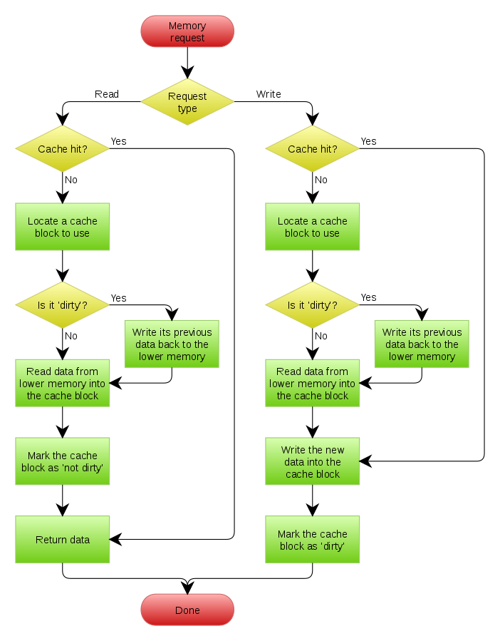

# Cache Lab
## Part 1
In part 1 we need to simulate how cache works. The whole process can be described down below:

Solution to this problem is down below:
```c
#include "cachelab.h"
#include <getopt.h>
#include <stdio.h>
#include <stdlib.h>
#include <unistd.h>

/* indexing cache by macro */
#define IDX(m, n, E) m *E + n
#define MAXSIZE 30
char input[MAXSIZE]; /* store a input line */
int hit_count = 0, miss_count = 0, eviction_count = 0;
int debug = 0; /* flag -v*/

/* cache struct */
typedef struct sCache {
  int valid; /* valid bit */
  int tag;   /* tag bit */
  int count; /* number of access count */
} Cache;


/* Cache last_eviction; */

/* convert hex character to integer */
int hextodec(char c);

/* load cache */
void Load(int count, unsigned int setindex, unsigned int tag,
          unsigned int offset, unsigned int size, double s_pow, unsigned int E,
          double b_pow, Cache *cache);

int main(int argc, char *argv[]) {
  const char *str = "Usage: ./csim [-hv] -s <num> -E <num> -b <num> -t "
                    "<file>\nOptions:\n  -h Print this help message.\n  -v "
                    "Optional verbose flag.\n  -s <num> Number of set index "
                    "bits.\n  -E <num> Number of lines per set.\n  -b <num> "
                    "Number of block offset bits.\n  -t <file> Trace file.\n\n"
                    "Examples :\n linux> ./csim -s 4 -E 1 -b 4 -t "
                    "traces/yi.trace\n linux>  ./csim -v -s 8 -E 2 "
                    "-b 4 -t traces/yi.trace\n "; // help info
  int opt = 0;
  unsigned int s = 0, E = 0, b = 0; /* number of set index bits, number of lines per set, numer of blocks offset bits */
  double s_pow = 0, b_pow = 0; /* number of sets, number of blocks */
  char *t = "";                /* trace  file*/


  /* getopt: */
  while ((opt = getopt(argc, argv, "hvs:E:-b:-t:")) != -1) {
    switch (opt) {
    case 's':
      s = atoi(optarg);
      s_pow = 1 << s; /* num of sets */
      break;
    case 'E':
      E = atoi(optarg); /* num of lines per set */
      break;
    case 'b':
      b = atoi(optarg);
      b_pow = 1 << b; /* num of blocks per line */
      break;
    case 't':
      t = optarg; /* trace file*/
      break;
    case 'v':
      debug = 1; /* v flag */
      break;
    case 'h':
      printf("%s", str); /* help info*/
      return 0;
      break;
    default: /* '?' */
      fprintf(stderr, "Usage: %s [-hv] -s <num> -E <num> -b <num> -t <file>\n",
              argv[0]);
      exit(EXIT_FAILURE);
    }
  }


  Cache *cache = (Cache *)malloc(sizeof(Cache) * s_pow * E); /* cache array */
  for (int i = 0; i < s_pow * E; i++) { /* init */
    cache[i].valid = 0;
    cache[i].tag = 0;
    cache[i].count = 0;
  }
  FILE *fp = fopen(t, "r"); /* open trace file */
  int count = 0;            /* Cache access count updator */

  /* analyse trace file in line */
  /*e.g. format: 
    L 10,1 miss
    M 20,1 miss hit
    L 22,1 hit
    S 18,1 hit
    L 110,1 miss eviction
    L 210,1 miss eviction
    M 12,1 miss eviction hit
    hits:4 misses:5 evictions:3
  */
  while (fgets(input, MAXSIZE, fp)) {
    int op = 0; /* num of access in need */
    unsigned int offset = 0, tag = 0,
                 setindex = 0; /* block offset，tag ，set index */
    char c;
    int exist_comma = 0;                      /* comma flag */
    unsigned int address = 0, size = 0; /* cache address, size */
    count++;

    for (int i = 0; (c = input[i]) && (c != '\n'); i++) {
      if (c == ' ') { /* pass space */
        continue;
      } else if (c == 'I') {
        op = 0; /* I: access one time */
      } else if (c == 'L') {
        op = 1; /* L: access one time */
      } else if (c == 'S') {
        op = 1; /* S: access one time */
      } else if (c == 'M') {
        op = 2; /* M: access two times */
      } else if (c == ',') {
        exist_comma = 1; /* comma exist */
      } else {
        if (exist_comma) {          
          size = hextodec(c);
        } else {
          address =
              16 * address + hextodec(c);
        }
      }
    }

    /* get offset from address */
    for (int i = 0; i < b; i++) {
      offset = offset * 2 + address % 2;
      address >>= 1;
    }

    /* get set index from address */
    for (int i = 0; i < s; i++) {
      setindex = setindex * 2 + address % 2;
      address >>= 1;
    }

    /* get tag from address */
    tag = address;

    if (debug && op != 0) {
      printf("\n%s", input);
    }
    if (op == 1) {
      Load(count, setindex, tag, offset, size, s_pow, E, b_pow, cache);
    }
    /* M: access two times，at first load, at second hit straightly*/
    if (op == 2) {
      Load(count, setindex, tag, offset, size, s_pow, E, b_pow, cache);
      hit_count++;
      if (debug) {
        printf(" hit");
      }
    }

  }

  free(cache);
  fclose(fp);
  // optind: num of opt args
  if (optind > argc) {
    fprintf(stderr, "Expected argument after options\n");
    exit(EXIT_FAILURE);
  }

  if (debug) {
    printf("\n");
  }
  printSummary(hit_count, miss_count, eviction_count);
  return 0;
}

/* convert hex to dec */
int hextodec(char c) {
  if (c >= '0' && c <= '9') {
    return c - '0';
  }
  if (c >= 'A' && c <= 'F') {
    return c - 'A' + 10;
  }
  if (c >= 'a' && c <= 'f') {
    return c - 'a' + 10;
  }
  return 0;
}

/* load cache */
void Load(int count, unsigned int setindex, unsigned int tag,
          unsigned int offset, unsigned int size, double s_pow, unsigned int E,
          double b_pow, Cache *cache) {

  /* commare with tag, if exists, then hit */
  for (int i = 0; i < E; i++) {
    if (cache[IDX(setindex, i, E)].valid &&
        tag == cache[IDX(setindex, i, E)].tag) {
      cache[IDX(setindex, i, E)].count = count;
      hit_count++;
      if (debug) {
        printf(" hit");
      }
      return;
    }
  }

  /* if not hit, select a free cache*/
  miss_count++;
  if (debug) {
    printf(" miss");
  }
  for (int i = 0; i < E; i++) {
    if (!cache[IDX(setindex, i, E)].valid) {
      cache[IDX(setindex, i, E)].tag = tag;
      cache[IDX(setindex, i, E)].count = count;
      cache[IDX(setindex, i, E)].valid = 1;
      return;
    }
  }

  /* if full, knock out a cache*/
  int mix_index = 0, mix_count = 1000000000;
  for (int i = 0; i < E; i++) {
    if (cache[IDX(setindex, i, E)].count < mix_count) {
      mix_count = cache[IDX(setindex, i, E)].count;
      mix_index = i;
    }
  }

  eviction_count++;
  if (debug) {
    printf(" eviction");
  }

  cache[IDX(setindex, mix_index, E)].tag = tag;
  cache[IDX(setindex, mix_index, E)].count = count;
  cache[IDX(setindex, mix_index, E)].valid = 1;

  return;
}
```

## Part 2
In part 2 we need to optimize the performance of matrix transposition. We can improve it by incresasing temporal and spatial locality, makeing full use of mechanism of cache, i.e. using blocking method:
```c
void transpose_submit(int M, int N, int A[N][M], int B[M][N]) {
  int i, j, ii, jj, a1, a2, a3, a4, a5, a6, a7, a0;
  if (M == 32) {

    for (i = 0; i < N; i += 8) {
      for (j = 0; j < M; j += 8) {
        for (ii = i; ii < i + 8; ii++) {
          jj = j;
          a0 = A[ii][jj];
          a1 = A[ii][jj + 1];
          a2 = A[ii][jj + 2];
          a3 = A[ii][jj + 3];
          a4 = A[ii][jj + 4];
          a5 = A[ii][jj + 5];
          a6 = A[ii][jj + 6];
          a7 = A[ii][jj + 7];
          B[jj][ii] = a0;
          B[jj + 1][ii] = a1;
          B[jj + 2][ii] = a2;
          B[jj + 3][ii] = a3;
          B[jj + 4][ii] = a4;
          B[jj + 5][ii] = a5;
          B[jj + 6][ii] = a6;
          B[jj + 7][ii] = a7;
        }
      }
    }
  } else if (M == 64) {
    for (i = 0; i < N; i += 4) {
      for (j = 0; j < M; j += 4) {
        for (ii = i; ii < i + 4; ii++) {
          jj = j;
          a0 = A[ii][jj];
          a1 = A[ii][jj + 1];
          a2 = A[ii][jj + 2];
          a3 = A[ii][jj + 3];
          B[jj][ii] = a0;
          B[jj + 1][ii] = a1;
          B[jj + 2][ii] = a2;
          B[jj + 3][ii] = a3;
        }
      }
    }
  } else {
    for (i = 0; i < N; i += 16) {
      for (j = 0; j < M; j += 16) {
        for (ii = i; ii < i + 16 && ii < N; ii++) {
          for (jj = j; jj < j + 16 && jj < M; jj++) {
            a0 = A[ii][jj];
            B[jj][ii] = a0;
          }
        }
      }
    }
  }
}
```